------

## **Description :**

C'est une couche d'abstraction au dessus du Framework Spring. Il est open-source et en Java. Il permet de créer des micro services qui sont en fait un développement et un déploiement de services indépendants.  Spring boot a été fondé par Pivotal Team.

------

## **<u>Pourquoi Choisir Spring boot :</u>**

- Spring boot accélère et facilite la création d'applications nécessitant le Framework Spring.

- Il a été développé selon le principe <u>R</u>apid <u>A</u>pplication <u>D</u>éveloppement. RAD permet d'être flexible aux changements et est destiné au projet devant être livré tôt (2-3 mois) . Il permet de découper un gros projet en petits et il focus sur la réutilisation de Template, d'outils, de processus et de code.

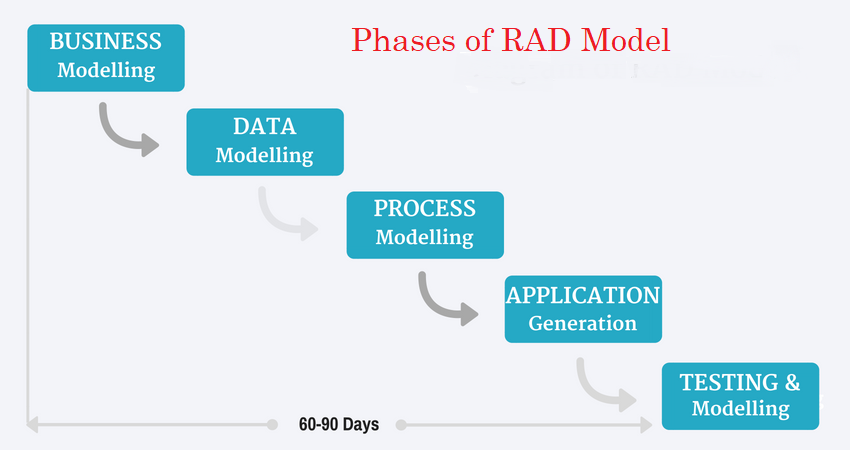

- Il intègre les serveurs web Tomcat, Jetty et Undertow

  

   	   

- Il offre l'option de configurer automatiquement les dépendances de l'application avec Maven ou Gradle.

 

- Il nécessite aucune configuration d'Xml comme Spring.

------

## <u>Évolution de Spring et Spring boot :</u>

| <u>Ligne de temps</u> |                        |
| --------------------- | ---------------------- |
| **<u>Spring</u>**     | <u>**Spring boot**</u> |
| 0.9 (2003)            | 1.0.0 (Avril 2014)     |
| 1.0 (2004)            | 1.1 (Juin 2014)        |
| 2.0 (2006)            | 1.2 (2015)             |
| 2.5 (2007)            | 1.3 (2016)             |
| 3.0 (2009)            | 1.4 (Juin 2016)        |
| 3.1 (2011)            | 1.5 (2017)             |
| 4.0 (2013)            | 2.0 (2018)             |
| 4.2 (2015)            | 2.1 (Octobre 2018)     |
| 5 (2017)              | 2.2 (2019)             |
| 5.1 (2018)            |                        |
| 5.2 (2019)            |                        |

------

## <u>**Architecture :**</u>

<u></u>

<u>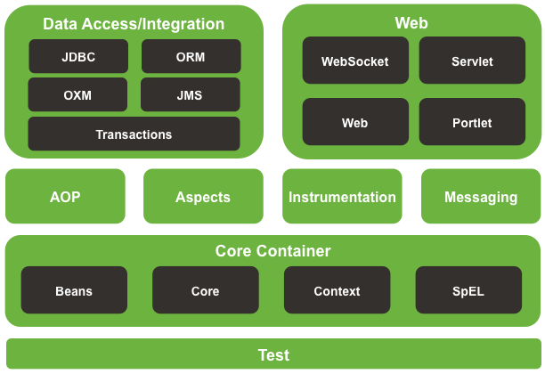</u>

------

## <u>**Options :**</u>

<u>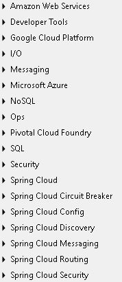 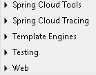</u>

### <u>**Options spécifiques:**</u>

| <u>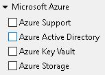</u> | <u>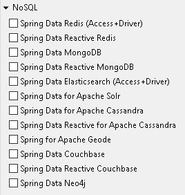</u> | <u>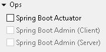</u> | <u>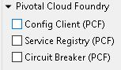</u> |
| ------------------------------------------------------------ | ------------------------------------------------------------ | ------------------------------------------------------------ | ------------------------------------------------------------ |
| <u>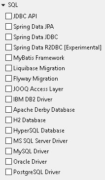</u> | <u>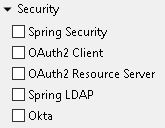</u> | <u>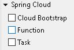</u> | <u>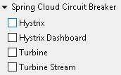</u> |
| <u>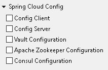</u> | <u>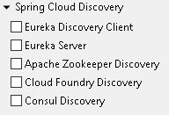</u> | <u>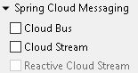</u> | <u>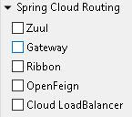</u> |
| <u>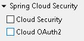</u> | <u>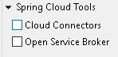</u> | <u>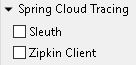</u> | <u>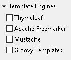</u> |
| <u>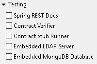</u> | <u>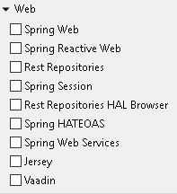</u> |                                                              |                                                              |

------

## <u>Tutoriel d'utilisation de Spring Boot :</u>

- <u><a href="/Thymeleaf/README.md">Thymeleaf</a></u>
- <u><a href="/RestApi/README.md">Api Rest</a></u>
- <u><a href="/JDBC/PostgreSQL/README.md">JDBC avec PostgreSQL</a></u>
- <u><a href="/JDBC/MySQL/README.md">JDBC avec MySQL</a></u>

------

## <u>**Références:**</u>

<u>https://www.tutorialspoint.com/spring_boot/spring_boot_introduction.htm</u>

<u>https://www.javatpoint.com/spring-boot-tutorial</u>

<u>https://en.wikipedia.org/wiki/Spring_Framework</u>

<u>https://github.com/spring-projects/spring-framework/wiki/Spring-Framework-Versions</u>

<u>https://www.quickprogrammingtips.com/spring-boot/history-of-spring-framework-and-spring-boot.html</u>

<u>https://mvnrepository.com/artifact/org.springframework.boot/spring-boot</u>