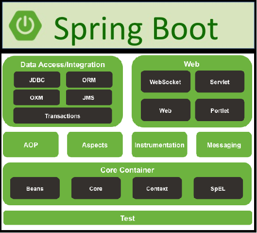

## <ins>**Description :**</ins>

Selon la description de «Tutorialspoint» (https://www.tutorialspoint.com/spring_boot/spring_boot_introduction.htm), SpringBoot est un logiciel ouvert basé sur le langage de programmation Java. C'est une couche d'abstraction qui opère au-dessus du «framework» Spring. Il permet de créer des micro services qui sont en fait un développement et un déploiement de services indépendants. 

SpringBoot permet entre autres la création d'applications Spring qui sont des micro-services indépendants prêts au déploiement de façon rapide, en facilitant la configuration nécessaire pour l'utilisation de Spring.

Spring boot a été développé par l'équipe Pivotal (https://pivotal.io/).

## <ins>Ses avantages</ins> :

- Déploiement facile d'applications.
- Accélère et facilite la création d'applications nécessitant le Framework Spring.

- Il a été développé selon le principe <u>R</u>apid <u>A</u>pplication <u>D</u>éveloppement. RAD permet d'être flexible aux changements et est destiné au projet devant être livré tôt (2-3 mois) . Il permet de découper un gros projet en petits et ils mettent l'accent sur la réutilisation de Template, d'outils, de processus et de code. Cela permet donc de réduire le temps de production de logiciels.

- Il intègre les serveurs web Tomcat, Jetty et Undertow

  

   	   

- Il offre l'option de configurer automatiquement les dépendances de l'application avec Maven ou Gradle.

 

- Il ne nécessite aucune configuration d'Xml comme Spring.
- Scalabilité simplifiée.
- Compatible avec le principe de «Containers» (Logiciel Docker par exemple).

## <ins>Ses inconvénients :</ins>

- Les configurations automatiques de SpringBoot ne peuvent pas combler les besoins spécifiques d'un projet de développement d'application.
- SpringBoot inclut parfois des dépendances qui ne seront pas utilisées, produisant une application plus volumineuse que ce qui est requis.
- Quoique bien conçu pour le développement initial d'application Spring, il sera difficile de convertir une application Spring en application SpringBoot par la suite.

## <ins>Évolution de Spring et Spring boot :</ins>

| <u>Ligne de temps</u> |                        |
| --------------------- | ---------------------- |
| **<u>Spring</u>**     | <u>**Spring boot**</u> |
| 0.9 (2003)            | 1.0.0 (Avril 2014)     |
| 1.0 (2004)            | 1.1 (Juin 2014)        |
| 2.0 (2006)            | 1.2 (2015)             |
| 2.5 (2007)            | 1.3 (2016)             |
| 3.0 (2009)            | 1.4 (Juin 2016)        |
| 3.1 (2011)            | 1.5 (2017)             |
| 4.0 (2013)            | 2.0 (2018)             |
| 4.2 (2015)            | 2.1 (Octobre 2018)     |
| 5 (2017)              | 2.2 (2019)             |
| 5.1 (2018)            |                        |
| 5.2 (2019)            |                        |

## <ins>**Architecture :**</ins>

<u></u>

## <ins>**Options :**</ins>

<u> </u>

### <ins>**Options spécifiques:**</ins>

| <u></u> | <u></u> | <u></u> | <u></u> |
| ------------------------------------------------------------ | ------------------------------------------------------------ | ------------------------------------------------------------ | ------------------------------------------------------------ |
| <u></u> | <u></u> | <u></u> | <u></u> |
| <u></u> | <u></u> | <u></u> | <u></u> |
| <u></u> | <u></u> | <u></u> | <u></u> |
| <u></u> | <u></u> |                                                              |                                                              |

------

## <ins>Objectif des tutoriels</ins>

### Thymeleaf :

Ce tutoriel montre l'installation et l'utilisation de base des outils pour utiliser Spring Boot et Thymeleaf.

1. Il explique comment installer Java et l'ide Spring tools 4.
2. Il montre comment créer un nouveau projet et comment ajouter des bibliothèques (Dépendances).
3. Finalement, on réalise pas à pas un programme simple utilisant la bibliothèque Thymeleaf qui permet à partir de notre programme Java d'afficher des données sur une page HTML5.

### Api Rest : 

L'objectif principal de ce tutoriel est de construire une application web suivant le modèle MVC Restful en utilisant les fonctionnalités de bases de SpringBoot. Les objectifs de ce tutoriel sont :

1. Démarrer une application Spring de base en utilisant SpringBoot.
2. Construire une application web suivant le modèle MVC.
3. Utiliser les fonctionnalités Springboot afin de créer une application web Restful.
4. Créer des interfaces logiques qui permettent l'injection de dépendances en utilisant les fonctionnalités de SpringBoot.
5. Utiliser certaines annotations de SpringBoot pour effectuer des validations lors de requêtes à notre API.

### JDBC avec PostgreSQL :

Ce tutoriel vise à intégrer une base de données relationnelle à notre application web construite dans le tutoriel « API Rest ». Les objectifs sont entre autre de :

1. Intégrer une base de données PostgreSQL au modèle d'application web MVC.
2. Utiliser le logiciel Docker afin d'intégrer la base de données PostgreSQL.
3. Faire l'insertion de données persistantes dans notre base de données.
4. Effectuer des requêtes afin de recueillir l'information persistante en base de données.

## <ins>Tutoriel d'utilisation de Spring Boot :</ins>

- <u><a href="/Thymeleaf/README.md">Thymeleaf</a></u>
- <u><a href="/RestApi/README.md">Api Rest</a></u>
- <u><a href="/JDBC/PostgreSQL/README.md">JDBC avec PostgreSQL (Suite Api Rest)</a></u>

## <ins>**Références:**</ins>

<u>https://www.tutorialspoint.com/spring_boot/spring_boot_introduction.htm</u>

<u>https://www.javatpoint.com/spring-boot-tutorial</u>

<u>https://en.wikipedia.org/wiki/Spring_Framework</u>

<u>https://github.com/spring-projects/spring-framework/wiki/Spring-Framework-Versions</u>

<u>https://www.quickprogrammingtips.com/spring-boot/history-of-spring-framework-and-spring-boot.html</u>

<u>https://mvnrepository.com/artifact/org.springframework.boot/spring-boot</u>