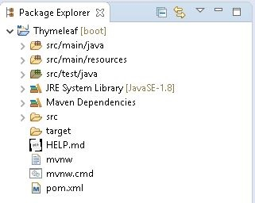
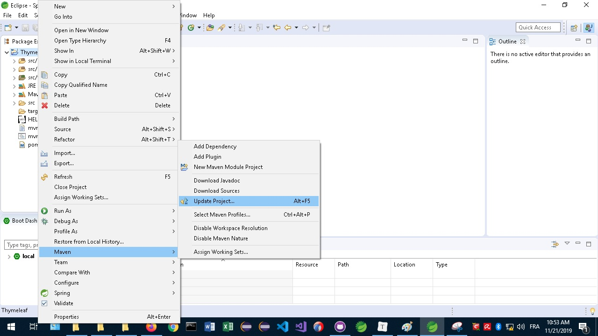

# **Spring boot with Thymeleaf**


## **<ins>Description:</ins>**

Thymeleaf est un Template Java XML/ XHTML/ HTML5  qui permet de travailler sur un environnement web. Il est utilisé comme la couche vue des applications basées sur le patron de conception MVC . 

## **<ins>Préroquis :</ins>**

### **<ins>Java :</ins>**

On doit télécharger et installer Java 8 pour Windows X32 ou X64.

<a href="https://www.oracle.com/technetwork/java/javase/downloads/jdk8-downloads-2133151.html">Télécharger java 8u231 </a>


### **<ins>Ide Spring boot :</ins>**

Il faut télécharger et installer l'ide Spring Tools 4 for Eclipse permettant de simplifier l'utilisation de Spring.

<a href="https://spring.io/tools">Télécharger Spring tools 4</a>


<ins>**Installation :**</ins>


1- Extraire l'ide en exécutant le .jar.


2- Une fois extrait, on exécute l'exécutable.


3- Il nous demande de sélectionner un dossier de sauvegarde par défaut.


4- Voici l'ide complet pour Spring boot.


## **<ins>Création d'une application utilisant Thymeleaf :</ins>**

1- Création d'un nouveau projet Spring Boot.


2- On entre la description de notre projet. On n'a pas besoin de toucher au Service URL, parce que c'est le site pour Spring Initializr. Spring tools 4 en a besoin pour générer le projet initial.


Group = le nom du paquet.

Artifact = le nom du .jar généré, normalement c'est le même que la section (Name).

3- On sélectionne les 2 dépendances pour notre projet. Un fichier pom.xml est généré parce qu'on utilise Maven.


On obtient le résultat ci-dessous.



4- On doit ajouter cette dépendance au fichier pom.xml pour que le programme fonctionne.

```xml
<dependency>
    <groupId>org.springframework.boot</groupId>
    <artifactId>spring-boot-starter-data-solr</artifactId>
</dependency>
```
5- On update notre projet avec Maven.




6- On créer nos 3 classes (Application.java, HomeController.java et User.java).


7 - Écrire le programme.

**<ins>pom.xml</ins>**

```xml
<?xml version="1.0" encoding="UTF-8"?>
<project xmlns="http://maven.apache.org/POM/4.0.0" xmlns:xsi="http://www.w3.org/2001/XMLSchema-instance"
	xsi:schemaLocation="http://maven.apache.org/POM/4.0.0 https://maven.apache.org/xsd/maven-4.0.0.xsd">
	<modelVersion>4.0.0</modelVersion>	
	<parent>
		<groupId>org.springframework.boot</groupId>
		<artifactId>spring-boot-starter-parent</artifactId>
		<version>2.2.1.RELEASE</version>
		<relativePath/> <!-- lookup parent from repository -->
	</parent>	
	<groupId>com.SpringBoot</groupId>
	<artifactId>demo</artifactId>
	<version>0.0.1-SNAPSHOT</version>
	<name>SpringBoot</name>
	<properties>
		<java.version>1.8</java.version>
	</properties>
	<dependencies>
		<dependency>
			<groupId>org.springframework.boot</groupId>
			<artifactId>spring-boot-starter-web</artifactId>
		</dependency>
		<dependency>
			<groupId>org.springframework.boot</groupId>
			<artifactId>spring-boot-starter-test</artifactId>
			<scope>test</scope>
			<exclusions>
				<exclusion>
					<groupId>org.junit.vintage</groupId>
					<artifactId>junit-vintage-engine</artifactId>
				</exclusion>
			</exclusions>
		</dependency>		
		<dependency>
			<groupId>org.springframework.boot</groupId>
			<artifactId>spring-boot-starter-thymeleaf</artifactId>
		</dependency>
		<dependency>
			<groupId>org.springframework.boot</groupId>
			<artifactId>spring-boot-starter-data-solr</artifactId>
		</dependency>
		<dependency>
			<groupId>org.springframework.boot</groupId>
			<artifactId>spring-boot-devtools</artifactId>
		</dependency>				
	</dependencies>	
	<build>
		<plugins>
			<plugin>
				<groupId>org.springframework.boot</groupId>
				<artifactId>spring-boot-maven-plugin</artifactId>
			</plugin>
		</plugins>
	</build>	
</project>
```

<ins>**Application.java**</ins>

```java
package com.example.demo;

import org.springframework.boot.SpringApplication;
import org.springframework.boot.autoconfigure.SpringBootApplication;

@SpringBootApplication
public class Application {

	public static void main(String[] args) {
		SpringApplication.run(Application.class, args);
	}
}
```

**<ins>HomeController.java</ins>**  (Contrôleur du patron MVC)

```java
package com.example.demo;

import org.springframework.web.bind.annotation.ModelAttribute;
import org.springframework.web.bind.annotation.RequestMapping;
import org.springframework.web.bind.annotation.RequestMethod;
import org.springframework.web.servlet.ModelAndView;
import org.springframework.stereotype.Controller;

@Controller
public class HomeController {

    @RequestMapping("/")
    public String index(){
        return "index";
    }
    
    @RequestMapping(value="/save", method=RequestMethod.POST)
    public ModelAndView save(@ModelAttribute User user) {
    	ModelAndView modelAndView = new ModelAndView();
    	modelAndView.setViewName("user-data");
    	modelAndView.addObject("user", user);	
    	return modelAndView;
    }
}
```

(value="/save") du @RequestMapping permet de dire quoi afficher dans l'url lorsqu'on fait un Post d'informations vers l'Html.

### **<ins>Erreurs possibles :</ins>**

Il ne faut pas nommer le nom de votre classe Controller parce que cela interfère avec le tag @Controller.

**<ins>User.java</ins>**

```java
package com.example.demo;

public class User {
	String name;
	
	String email;
	
	public String getName() {
		return name;
	}
	
	public void setName(String name) {
		this.name = name;
	}
	
	public String getEmail() {
		return email;
	}
	
	public void setEmail(String email) {
		this.email = email;
	}
}
```

8- Fichier final avant l'exécution du programme.


9- Exécuter en utilisant Application.java comme main du programme.


Affichage de l'exécution de Spring dans la console.


10- Ouvrir votre navigateur préféré et entrer localhost:8080.


11- Inscrire des informations tests et faire Submit.


On obtient le résultat ci-dessous.


## **<ins>Conclusion :</ins>**

L'application peut sembler simpliste, mais Thymeleaf permet à partir d'un programme de construire une page Html5 en envoyant des valeurs bidirectionnelles entre notre programme java et l'interface web.

